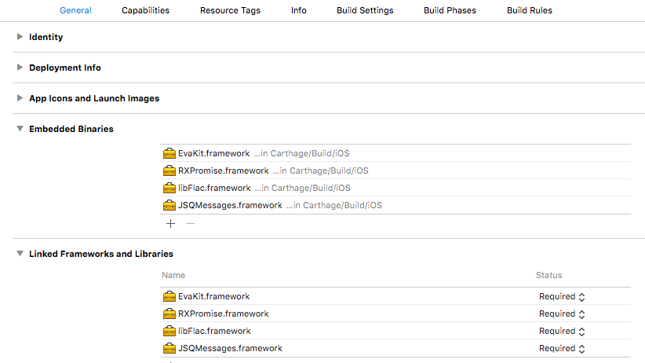

# Eva VoiceKit SDK for iOS


 [](https://github.com/evature/ios/blob/master/license.md)
[](https://github.com/Carthage/Carthage)


<!-- START doctoc generated TOC please keep comment here to allow auto update -->
<!-- DON'T EDIT THIS SECTION, INSTEAD RE-RUN doctoc TO UPDATE -->


- [Introduction](#introduction)
- [Step 1: Include the SDK in your Xcode project](#step-1-include-the-sdk-in-your-xcode-project)
- [Step 2: Initialize the Eva Application](#step-2-initialize-the-eva-application)
- [Step 3: Add a Microphone Chat Button to the GUI](#step-3-add-a-microphone-chat-button-to-the-gui)
  - [Method 1 - Using Interface Builder](#method-1---using-interface-builder)
  - [Method 2 - From Code using EVApplication](#method-2---from-code-using-evapplication)
  - [Method 3 - Use an existing button in the user interface](#method-3---use-an-existing-button-in-the-user-interface)
- [Step 4: Implement one or more Delegates](#step-4-implement-one-or-more-delegates)
- [More details](#more-details)
- [Support](#support)

<!-- END doctoc generated TOC please keep comment here to allow auto update -->

## Introduction

Voice enable a travel application in a couple of hours using the Eva VoiceKit SDK.

With the VoiceKit you can add a cutting edge voice interface to your travel application with super simple integration.

Take advantage of the latest Deep Learning algorithms delivering near human precision.

The Eva Voice SDK comes batteries-included and has everything an application needs:

* Speech Recognition

* Natural Language Understanding

* Dialog Management

* Voice Chat user interface overlay

The beautiful user interface conforms to the latest design guidelines and is fully customizable to match your application.

The SDK is open source. Fork us [on Github](https://github.com/evature/ios)!

## Step 1: Include the SDK in your Xcode project

1. *Option 1* - Using CocoaPods

  Add EvaKit to your Podfile.

  ``` podfile
    source 'https://github.com/CocoaPods/Specs.git'
    source 'https://github.com/evature/Eva-Pods.git'
    pod 'EvaKit', '~>2.0'
  ```
  If you don't need to deploy on iOS 7 then add `use_frameworks!` too.  

  Then run `pod install` from the shell.

2. *Option 2* - Using Carthage

   Add `github "evature/ios" ~> 2.0` to you Carfile and run `carthage update` from the shell. Then add the resulting frameworks from Carthage/Build to your project, as described in [Carthage docs](https://github.com/Carthage/Carthage#if-youre-building-for-ios-tvos-or-watchos).

3. *Option 3* - Use the compiled binaries.

    a. Download the dependencies.zip from the files attached to the latest release in https://github.com/evature/ios/releases.

    b. Unzip the file and drag & drop the *.framework folders into your project.

    c. Add the framework files to the "Embedded Binaries" in your project settings (under the General tab) - eg. 


----
Verify that your project is setup correctly:

Import the EvaKit header in your App Delegate and check that it compiles without an error.
  ``` objc
  #import <EvaKit/EvaKit.h>
  ```

## Step 2: Initialize the Eva Application

You will need credentials from Evature - register for a free account [here](http://www.evature.com/registration/form)

  ``` objc
  - (BOOL)application:(UIApplication *)application didFinishLaunchingWithOptions:(NSDictionary *)launchOptions {
      // Set level of logging. See EVLogger.h.
      [EVLogger logger].logLevel = EVLoggerLogLevelInfo;
      // Provide API key and Site Code.
      [[EVApplication sharedApplication] setAPIKey:@"your-api-key" andSiteCode:@"your-site-code"];
      // Setup all needed Eva features here(text highlighting, connection timeouts and etc.). See EVApplication.h
      // Override point for customization after application launch.
      // < your initialization code here >
      return YES;
  }
  ```

## Step 3: Add a Microphone Chat Button to the GUI  
### Method 1 - Using Interface Builder
  EvaKit uses new features of Xcode 6 so you can configure the microphone button and the Chat View in Interface Builder.
  Add an empty view inside your view and change its class to `EVVoiceChatButton`. You can setup all buttons and controller properties in Xcode. If no action is added to the button, the button will show the Chat View for the current controller by default.

### Method 2 - From Code using EVApplication
  ``` objc
  - (void)viewDidLoad {
      [super viewDidLoad];
      // Create and add button to view of current controller
      EVVoiceChatButton* button = [[EVApplication sharedApplication] addButtonInController:self];
      //Pin button to bottom
      [button ev_pinToBottomCenteredWithOffset:90.0f];
      // Set some button or chat view settings. See EVVoiceChatButton.h
      button.micLineWidth = 3.0f;
      button.chatControllerSpeakEnabled = NO;
      button.chatToolbarCenterButtonMicLineWidth = 2.0f;
  }
  ```

### Method 3 - Use an existing button in the user interface
  Call this EVApplication method for the Chat View overlay
  ``` objc
  [[EVApplication sharedApplication] showChatViewController:self withViewSettings:@{}];
  ```
  Where View Settings is an `NSDictionary` with Chat View and Chat Toolbar settings.
  Chat View parameters can be provided with a `controller.` prefix. Chat Toolbar parameters with a `toolbar.` prefix. The complete list of configurable parameters is detailed in `EVVoiceChatViewController.h` and in `EVChatToolbarContentView.h`

Repeat this for every applicable user interface destnation in your application.

## Step 4: Implement one or more Delegates
  At this point Eva can interact with the end users using voice. The end user can say "Hi" and Eva will respond using both text-to-speech and a chat overlay. If information is required from the end user, Eva will ask questions.
  When action is needed from the application (e.g. showing a boarding pass) a Delegate function will be called.
  You can implement the Delegate functions in current View Controller or in the Application Delegate. You can also provide your own object for this. If you want to use your own object, set it to the `chatControllerDelegate` property of the Microphone Chat Button or provide a `controller.delegate` value in the Settings Dictionary.  
  The complete list of Delegate callbacks can be found in the `Core/SearchModels/SearchDelegates` folder.
  Eva will infer the capabilities of the application by the Delegates that are, or are not implemented. For example if you do not implement the Car Search Delegate and the end user will request a "Car rental", Eva will reply that car rentals are not supported by this application.

## More details

  The  Eva VoiceKit is also available for Android: [Android GitHub Repository](https://github.com/evature/android)

  More methods and properties can be found in `EVApplication.h`, `EVVoiceChatButton.h`, `EVLogger.h`, `EVVoiceChatViewController.h`, `EVChatToolbarContentView.h`.

## Support

  We would love to hear from you as issues and pull requests. Also feel free to ask us anything at [info@evature.com](mailto:info@evature.com)
